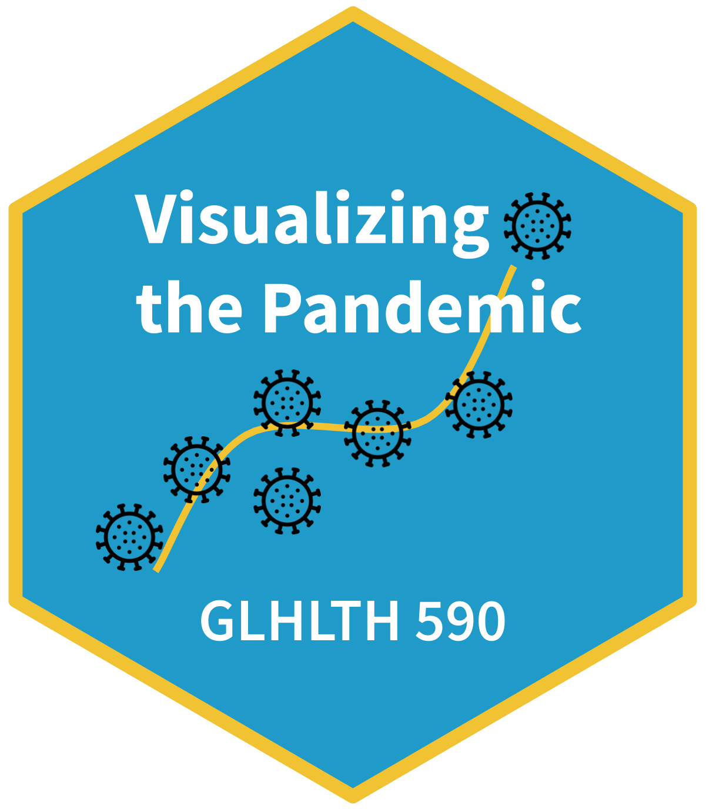

```{r, out.width='20%', out.extra='style="float:left; padding:10px"'}

```

This course will introduce you to data science and data visualization in R through the lens of the COVID-19 pandemic. Each week we will draw inspiration from visualizations of pandemic data we find online in blogs, newspapers, preprints, and journal articles. With each visualization, we'll consider what makes an effective graphic and how to reproduce it in R. The goal is to provide a glimpse of what you can do in R and to give you enough skills to know how to take the next step in your learning.

# Schedule

| Week | Date | Topic |
|--- | --- | --- |
| 1 | T May 19 | Getting started with R, RStudio, and `{ggplot2}` |
| 2 | T May 26 | Data wrangling and exploratory data analysis |
| 3 | T Jun 2 | Animated plots and maps |
| 4 | T Jun 9 | Text mining and dashboards |
| 5 | T Jun 16 | Tidymodels |
| 6 | T Jun 24 | Projects due |

# Requirements

There are no prerequisites to take this course aside from a good dose of curiosity and interest in learning about R, data visualization, and data science. All you need to participate is a computer with an internet connection. We'll use [RStudio Cloud](https://rstudio.cloud) to run R, Zoom to connect each week, and Piazza to communicate and share ideas (and struggles).

We'll rely on lots of great resources online to guide our learning, but Kieran Healy's book [Data Visualization](https://socviz.co/) will be a constant. You can read a 2018 version online or pick up a paperback copy (currently less than $30 on Amazon). It's a beautiful book. I don't buy many hardcopies of books these days, but I have this one on my shelf.

## Format

Every Tuesday we'll have a synchronous discussion on Zoom at 9am Eastern. You'll prepare for this session by reading and watching videos. Then you'll have the rest of the week to work on a related (graded) assignment (due Fridays at 5pm Eastern). If you need help you can post to Piazza or join a Zoom drop in session. There are no scheduled exams, but you will complete an independent visualization project.

## Grading

You will be evaluated on the basis of your weekly assignments (50%) and independent visualization project (50%). Ranges for letter grades will be set at the end of the semester. Cumulative scores of at least 90, 80, and 70 will be guaranteed at least an A-, B-, and C-, respectively.

## Policies

* These are challenging times. If you miss an assignment deadline (Fridays at 5pm Eastern), get in touch so we can discuss if a make-up or extension is possible. Missing more than one deadline could result in grade penalties. 
* Failure to complete the independent project will result in an Incomplete. Please see your school's policy on incompletes for summer session courses (e.g., [Trinity](https://trinity.duke.edu/undergraduate/academic-policies/continuation-requirements))
* Students should abide by the [Duke Community Standard](https://studentaffairs.duke.edu/conduct/about-us/duke-community-standard) at all times. If a questionable circumstance arises, do not hesitate to seek my guidance (before is always better than after).
* Any student with a documented disability needing academic adjustments or accommodations should discuss this with me early in the term. All discussions will remain confidential. Students with disabilities should also contact the [Student Disability Access Office](http://www.access.duke.edu/students/requesting/index.php).