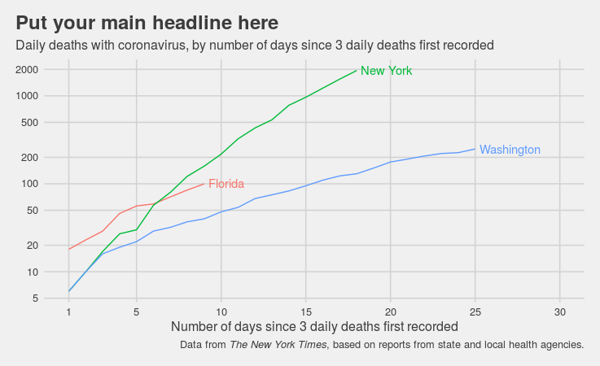

```{r, include=FALSE}
  library(emo)
```

# Overview

We'll kick things off with an intro to R, RStudio, and the plotting package we'll use throughout the course: `{ggplot2}`. You should have received an invite to our RStudio Cloud workspace. Please create a free account and explore a bit.  

# Prepare for May 19

* `r emo::ji("open_book")`: Chapters 1-3 in [*Data Visualization*](https://socviz.co/lookatdata.html#lookatdata). In your personal RStudio Cloud workspace, create a project for the book *Data Visualization* and complete the coding exercices as you read through the chapters.
* `r emo::ji("tv")`: [Introduction to R and RStudio](https://www.youtube.com/fntu_jMsWWE) ([Deck](https://learn.themethodsection.com/workshops/ieat/pandemic2020/decks/w01_deck.html#/section) | [Run locally](https://github.com/ericpgreen/ieat-covid2020/blob/master/assignments/wk01.Rmd) | Run in RStudio Cloud)
* `r emo::ji("tv")`: [Introduction to plotting in `ggplot2`](https://www.youtube.com/uAcny-EHDPA) ([Deck](https://learn.themethodsection.com/workshops/ieat/pandemic2020/decks/w02_deck.html#/section) | [Run locally](https://github.com/ericpgreen/ieat-covid2020/blob/master/assignments/wk02.Rmd) | Run in RStudio Cloud)

# Assignment (Due May 22, 5pm EDT)

Here is one of the plots we reproduced this week. It's the starting point for your assignment.

```{r, out.width='100%'}

```

Find the county-level NYTimes data and plot cumulative COVID-19 deaths in the five worst affected counties for your home state (or North Carolina). Be sure to provide a proper headline and update all of the plot details.